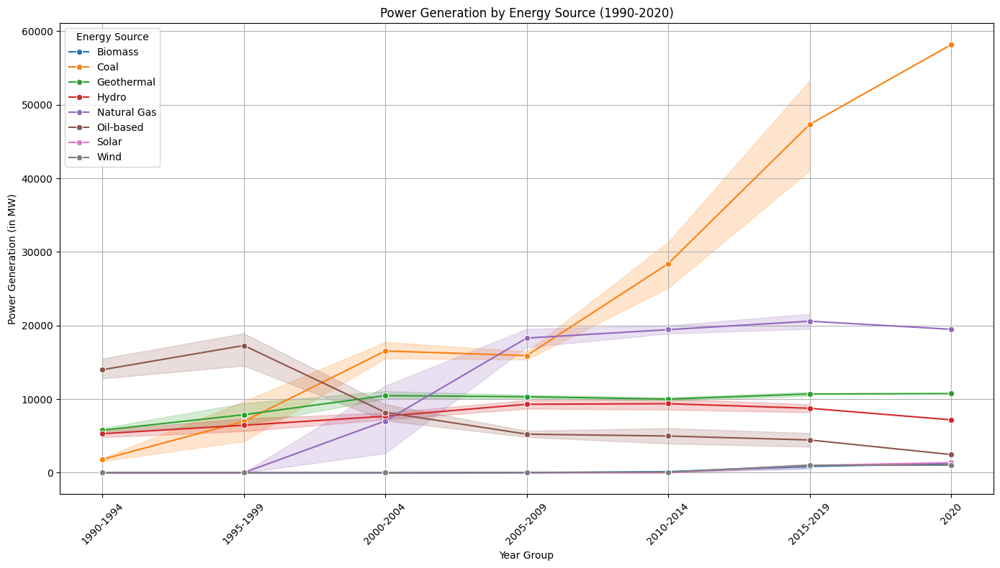
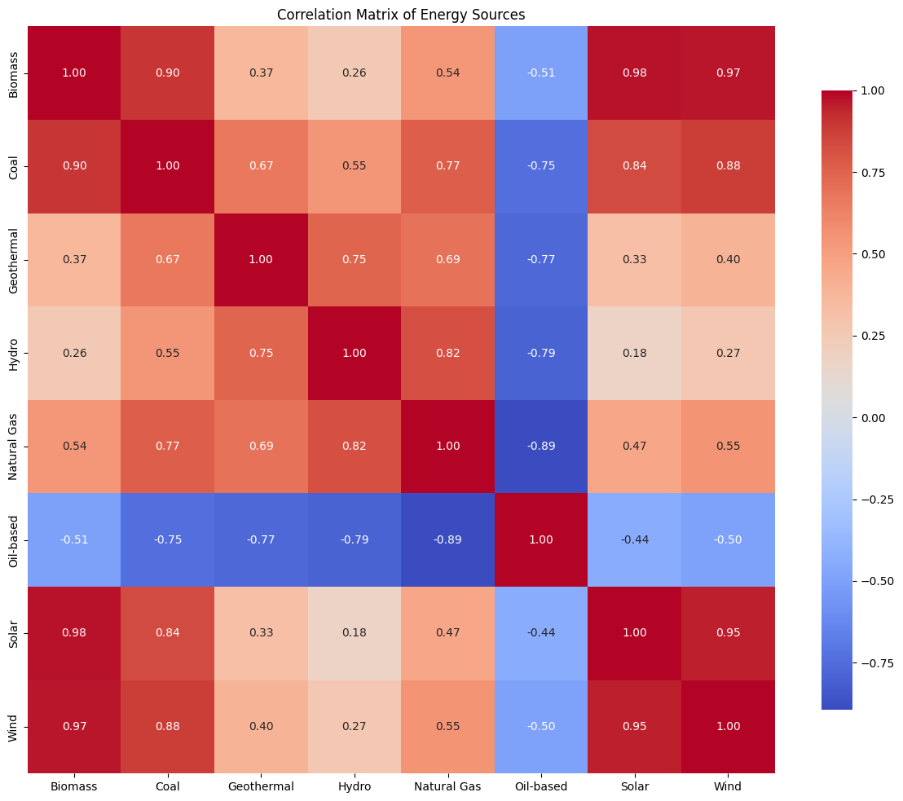

# Energy in Transition: An Analysis of Philippine Power Generation Trends (1990-2020)

## Summary
This project provides a comprehensive analysis of the Philippines' power generation landscape from 1990 to 2020. It aims to uncover the significant shifts in the nation's energy portfolio by tracking the performance of different fuel sources over three decades. The analysis highlights the country's transition away from oil-based power towards a more diverse mix of fossil fuels and emerging renewables, offering critical insights for community empowerment through informed discussions on energy security and sustainability.

## Methodology
The analysis was conducted using Python with the pandas library for data manipulation and cleaning. Initial data challenges, such as incorrect delimiter and encoding, were resolved during the loading phase. Exploratory data analysis involved creating time-series line plots with Matplotlib and Seaborn to visualize the trends of each fuel source. A correlation matrix was also generated to statistically quantify the relationships and inverse trends between different energy types.

## Key Findings
The analysis revealed a clear and significant energy transition over the 31-year period:
1.  **Decline of Oil:** Oil-based power generation, once a dominant source, showed a consistent and steep decline.
2.  **Rise of Fossil Fuels:** Coal and Natural Gas have grown to become major contributors to the national grid, largely replacing the gap left by oil.
3.  **Emergence of Renewables:** Wind and Solar generation, starting from zero, have shown significant growth in the last decade, indicating a burgeoning shift towards modern renewable sources.
4.  **Stable Legacy Sources:** Hydro and Geothermal power have remained remarkably stable and independent contributors throughout the entire period.

## Visualizations
The key visualizations produced are a time-series line plot showing the generation trends of each fuel source and a correlation matrix heatmap illustrating the relationships between them.

## Code
The analysis was conducted within a Jupyter Notebook. For the complete code, please refer to the notebook file: `energy.ipynb`.

## Challenges and Solutions
The primary challenge was related to data ingestion. The initial dataset could not be parsed correctly due to a tab delimiter instead of the standard comma. This was solved by opening the CSV file on Latest version of Microsoft Excel and saving a new copy of dataset. Minor encoding issues were also handled to ensure the data was loaded cleanly.

## Community Impact
This project provides accessible, data-driven insights into the Philippines' energy history. This information can empower local communities, policymakers, and advocacy groups to engage in more informed discussions about energy policy, sustainable development, and the future of the national power grid. Understanding these long-term trends is crucial for planning resilient and sustainable energy infrastructure.

## Future Work
Potential next steps include:
-   Forecasting future energy generation trends based on the historical data.
-   Conducting a deeper dive into the regional distribution of these power sources within the Philippines.

## Contributors
-   Carl Vincent Baydo (Data Analyst Student)

## License
This project is shared under the MIT License.